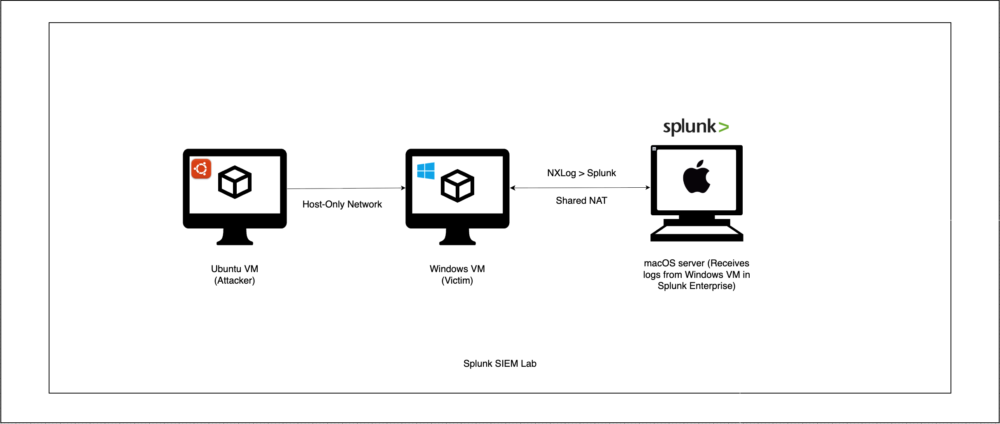

  

# Splunk Dual-VM SIEM Lab

This project documents a complete **Splunk SIEM Home Lab** built on macOS using two virtual machines running on UTM:

- **Ubuntu VM (Attacker)** – performs RDP brute-force, port scanning, SMB enumeration, and network recon
- **Windows 11 VM (Victim)** – generates logs (4624/4625/etc.) and forwards them to Splunk via NXLog  
- **Splunk Enterprise on macOS** – ingests logs and detects attacks in real time

This environment simulates realistic SOC/Blue-Team monitoring and detection scenarios.

---

# 🏛 Architecture

  

### **macOS Host (Splunk Server)**  
- Runs **Splunk Enterprise**
- Receives logs on **TCP 9997**
- Accessible via browser at: `http://localhost:8000`

---

### **Windows 11 ARM – Victim**
- **NIC 1 — Host-Only Network (`splunk-lab-net`):** `192.168.50.20`  
  Used for attacker ↔ victim communication
- **NIC 2 — Shared NAT:** `192.168.64.5`  
  Used for internet access
- **Log Forwarding:** NXLog → Splunk 
- Generates Security Events such as:
  - 4625 (Failed Logon)
  - 4624 (Successful Logon)
  - 4798 (Local Group Enumeration)
  - 4672 (Special Privileges Assigned)

---

### **Ubuntu 24.04 – Attacker**
- **Host-Only IP:** `192.168.50.10`
- Performs real-world attack simulations:
  - RDP brute force (via `xfreerdp`, `hydra`)
  - Port scanning (`nmap`)
  - SMB enumeration (`smbclient`, `enum4linux`)
  - Network probing

---

# 🔌 Host-Only Network Setup (`splunk-lab-net`)

A custom **Host-Only** network was created in UTM to allow isolated communication between Ubuntu (attacker) and Windows (victim).

**Why Host-Only?**
- Creates a private lab network  
- Prevents accidents on your real LAN  
- Ensures predictable static IP addressing  
- Allows Splunk/macOS to remain isolated

### ✔ Creating the Host-Only Network  
1. Open **UTM → Settings → Network**  
2. Click **Add → Name:** `splunk-lab-net`  
3. Assign this network to:
   - Ubuntu VM (Network Mode → Host Only → `splunk-lab-net`)
   - Windows VM (Network Mode → Host Only → `splunk-lab-net`)
4. Configure IPs:
   - **Windows:** Manual IPv4 → `192.168.50.20`
   - **Ubuntu:** Netplan static config → `192.168.50.10`

# 🛠 Tools Used

Below are the main tools used across macOS, Windows, and Ubuntu:

- **Splunk Enterprise 10.x** (SIEM)
- **UTM Virtualization on macOS**
- **Windows Event Logging + NXLog**
- **Ubuntu Attack Tools:**
  - `nmap`
  - `hydra`
  - `xfreerdp`
  - `enum4linux`
  - `smbclient`
- **Git & GitHub** (project documentation)

