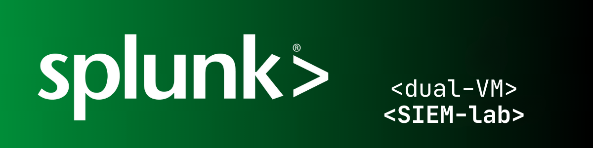

<p align="center">
  
</p>

# Splunk Dual-VM SIEM Lab (Ubuntu Attacker → Windows Victim)

This repo documents a home-lab SIEM environment running on macOS with:

- **Ubuntu VM (attacker)** – sends attacks (RDP/SMB/Nmap etc.) to
- **Windows VM (victim)** – forwards logs to
- **Splunk Enterprise on macOS** – used to detect and visualize security events.

## Architecture

- **Host:** macOS  
  - Runs Splunk Enterprise (Search & Reporting)
  - Listens on TCP `9997` for logs from Windows

- **Windows 11 ARM – Victim**
  - NIC 1 – Host Only (`splunk-lab-net`): `192.168.50.20`
  - NIC 2 – Shared (NAT): `192.168.64.5`
  - Runs NXLog to forward Windows Event Logs → Splunk (`index=win_logs`)

- **Ubuntu 24.04 – Attacker**
  - Host Only IP: `192.168.50.10`
  - Used to:
    - RDP/credential brute-force
    - Nmap scanning
    - SMB/WinRM probing
    - (Later) web attacks like SQLi/XSS if a web app is added

**Log flow (current core):**

```text
Ubuntu attacker (192.168.50.10)
      ↓ (RDP / SMB / Nmap)
Windows victim (192.168.50.20)
      ↓ Windows Security Log (4624/4625)
      ↓ NXLog (tcp:9997)
Splunk on macOS (index=win_logs)
